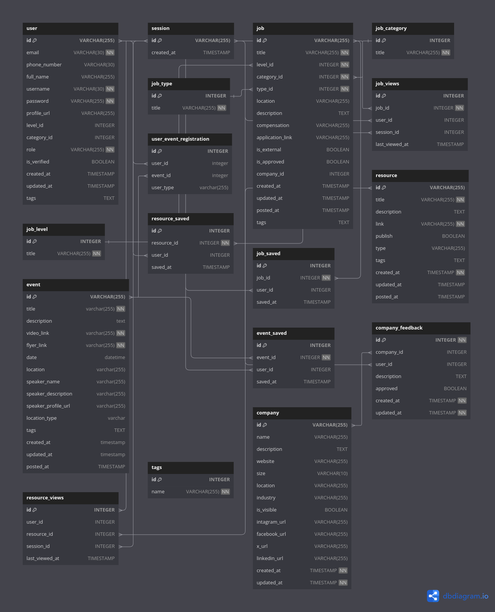

<!-- PROJECT SHIELDS -->
[![Contributors][contributors-shield]][contributors-url]
[![Forks][forks-shield]][forks-url]
[![Stargazers][stars-shield]][stars-url]
[![Issues][issues-shield]][issues-url]
[![MIT License][license-shield]][license-url]
[![LinkedIn][linkedin-shield]][linkedin-url]

<!-- PROJECT LOGO -->
 

  <h3 align="center">DeveLeb Platform</h3>
  

    The all in one platform for the tech community!
     
    <a href="https://develeb.github.io/Develeb-Platform/"><strong>Explore the api docs »</strong></a>
     
     
    <a href="https://github.com/DeveLeb/Develeb-Platform/">View Project</a>
    ·
    <a href="https://github.com/DeveLeb/Develeb-Platform/issues/new?labels=bug&template=bug-report.md">Report Bug</a>
    ·
    <a href="https://github.com/DeveLeb/Develeb-Platform/issues/new?labels=enhancement&template=feature-request.md">Request Feature</a>
  

<!-- TABLE OF CONTENTS -->

  
Table of Contents

  <ol>
    <li>
      <a href="#about-the-project">About The Project</a>
      <ul>
        <li><a href="#built-with">Built With</a></li>
      </ul>
    </li>
    <li>
      <a href="#getting-started">Getting Started</a>
      <ul>
        <li><a href="#prerequisites">Prerequisites</a></li>
        <li><a href="#installation">Installation</a></li>
      </ul>
    </li>
    <li><a href="#usage">Usage</a></li>
    <li><a href="#roadmap">Roadmap</a></li>
    <li><a href="#contributing">Contributing</a></li>
    <li><a href="#license">License</a></li>
    <li><a href="#contact">Contact</a></li>
    <li><a href="#acknowledgments">Acknowledgments</a></li>
  </ol>

<!-- ABOUT THE PROJECT -->
## About The Project

This platform will be a comprehensive portal into all things tech in Lebanon—jobs, events, resources, companies and more. 

(<a href="#readme-top">back to top</a>)

### Built With

* [![Next][Next.js]][Next-url]
* [![Node][Node.js]][Node-url]
* [![Express][Express.js]][Express-url]
* [![Lerna][Lerna.js]][Lerna-url]
* [![Tailwind][Tailwind.js]][Tailwind-url]

(<a href="#readme-top">back to top</a>)

<!-- DATABASE -->
## Data Model

(<a href="#readme-top">back to top</a>)

<!-- GETTING STARTED -->
## Getting Started

This is an example of how you may give instructions on setting up your project locally.
To get a local copy up and running follow these simple example steps.

### Prerequisites

### Installation

(<a href="#readme-top">back to top</a>)

<!-- ROADMAP -->
## Roadmap

(<a href="#readme-top">back to top</a>)

<!-- CONTRIBUTING -->
## Contributing

Contributions are what make the open source community such an amazing place to learn, inspire, and create. Any contributions you make are **greatly appreciated**.

If you have a suggestion that would make this better, please fork the repo and create a pull request. You can also simply open an issue with the tag "enhancement".
Don't forget to give the project a star! Thanks again!

1. Fork the Project
2. Create your Feature Branch (`git checkout -b feature/AmazingFeature`)
3. Commit your Changes (`git commit -m 'Add some AmazingFeature'`)
4. Push to the Branch (`git push origin feature/AmazingFeature`)
5. Open a Pull Request

(<a href="#readme-top">back to top</a>)

<!-- LICENSE -->
## License

Distributed under the MIT License. See `LICENSE.txt` for more information.

(<a href="#readme-top">back to top</a>)

<!-- MARKDOWN LINKS & IMAGES -->
<!-- https://www.markdownguide.org/basic-syntax/#reference-style-links -->
[contributors-shield]: https://img.shields.io/github/contributors/othneildrew/Best-README-Template.svg?style=for-the-badge
[contributors-url]: https://github.com/DeveLeb/Develeb-Platform/graphs/contributors
[forks-shield]: https://img.shields.io/github/forks/DeveLeb/Develeb-Platform.svg?style=for-the-badge
[forks-url]: https://github.com/DeveLeb/Develeb-Platform/network/members
[stars-shield]: https://img.shields.io/github/stars/DeveLeb/Develeb-Platform.svg?style=for-the-badge
[stars-url]: https://github.com/DeveLeb/Develeb-Platform/stargazers
[issues-shield]: https://img.shields.io/github/issues/DeveLeb/Develeb-Platform.svg?style=for-the-badge
[issues-url]: https://github.com/DeveLeb/Develeb-Platform/issues
[license-shield]: https://img.shields.io/github/license/DeveLeb/Develeb-Platform.svg?style=for-the-badge
[license-url]: https://github.com/DeveLeb/Develeb-Platform/blob/master/LICENSE.txt
[linkedin-shield]: https://img.shields.io/badge/-LinkedIn-black.svg?style=for-the-badge&logo=linkedin&colorB=555
[linkedin-url]: https://www.linkedin.com/company/develeb/
[Next.js]: https://img.shields.io/badge/next.js-000000?style=for-the-badge&logo=nextdotjs&logoColor=white
[Next-url]: https://nextjs.org/
[Node.js]: https://img.shields.io/badge/node.js-000000?style=for-the-badge&logo=nodedotjs&logoColor=white
[Node-url]: https://nodejs.org/
[Express.js]: https://img.shields.io/badge/express.js-000000?style=for-the-badge&logo=expressdotjs&logoColor=white
[Express-url]: https://expressjs.com/
[Lerna.js]: https://img.shields.io/badge/lerna.js-000000?style=for-the-badge&logo=lernasdotjs&logoColor=white
[Lerna-url]: https://lerna.js.org/
[Tailwind.js]: https://img.shields.io/badge/tailwind.js-000000?style=for-the-badge&logo=tailwinddotjs&logoColor=white
[Tailwind-url]: https://tailwindcss.com/
